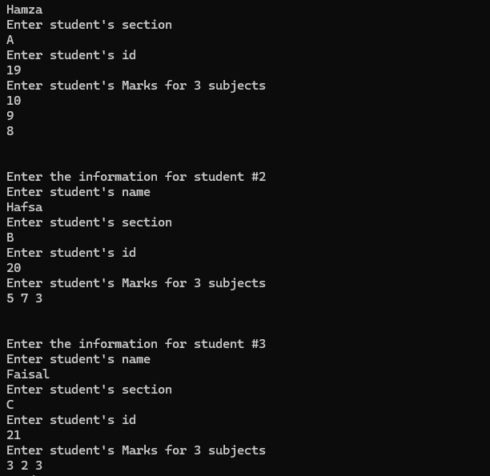
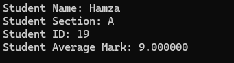

```c
// hmz
#include <stdio.h>
struct Student {
    char name[200];
    char section;
    int id ;
    int marks[3];
    float averageMark;
};
float averageMark(int marks[], int amountOfMarks){
    // Sum of all marks
    int sum=0,i;
    float average;
    for(i=0; i< amountOfMarks; i++){
        sum+= marks[i];
    }
    average = sum/amountOfMarks;
    return average;
}
struct Student getHighest(struct Student students[] , int numberOfStudents){
    // Temporary highest student, thought to be the first
    struct Student highest = students[0];
    int i;
    for(i=0; i<numberOfStudents; i++){
        // Get the highest student based on the highest average mark
        if(students[i].averageMark > highest.averageMark) highest = students[i];
    }
    return highest;
};
void inputStudents(struct Student students[], int numberOfStudents){
    int i;
    for(i=0; i < numberOfStudents; i++){
        printf("\n\nEnter the information for student #%d\n", i+1);
        printf("Enter student's name\n");
        // When scanning a string, getchar needs to be used around it should there be more scanfs
        getchar();
        scanf("%[^\n]s", &students[i].name);
        printf("Enter student's section\n");
        getchar();
        scanf("%c", &students[i].section);
        printf("Enter student's id\n");
        scanf("%d", &students[i].id);
        printf("Enter student's Marks for 3 subjects\n");
        // Input all three marks at once
        scanf("%d%d%d",&students[i].marks[0], &students[i].marks[1], &students[i].marks[2]);
        // Get the average mark of three
        students[i].averageMark = averageMark(students[i].marks, 3);

    }
    return;
};
void printStudentData (struct Student stud){
    printf("Student Name: %s\n", stud.name);
    printf("Student Section: %c\n", stud.section);
    printf("Student ID: %d\n", stud.id);
    printf("Student Average Mark: %f\n", stud.averageMark);
}
int main(){
    int numberOfStudents;
    printf("Enter the amount of students\n");
    scanf("%d", &numberOfStudents);
    // The array that will hold all the students
    struct Student students[numberOfStudents];
    // Populate the array with values
    inputStudents(students, numberOfStudents);
    // The student with the highest marks
    struct Student highest = getHighest(students, numberOfStudents);
    printf("\n\nThe highest is:\n")
    // Print the information for highest ranking student
    printStudentData(highest);
    return 0;
}
```
# Questions
**Question 1**
> Define the `Student` structure

The structure named "Student" has 5 members. 
1. A string named "name", it can hold up to 199 characters.
2. A char named "section".
3. An integer named "id".
4. An array of integers named "marks". It can have up to 3 elements
5. A float named "averageMarks".

**Question 2**
> Explain the `main` function

The main function first asks for the amount of students, stores it on the integer variable named "numberOfStudents". Then it creates an array of "struct Student" type, named "students".Using the inputStudents the array gets the data. Using the getHighest function, the highest ranking student is determined and it's stored into the "highest" variable. Finally using the "printStudentData", the "highest" student is printed 

**Question 3**
> Explain the `inputStudents` function

The purpose of the void function named "inputStudents" is to take data from the user and fill The "students" array.\
The function takes in two paratmeters.
1. An array of "struct Student" type named "students".
2. An integer named "numberOfStudents".

The function first loops the amount of desired students and it then asks for their data; "name", "section", "id" and "marks" sequentially. Afterwards it uses the "averageMark" function to get the average of the 3 marks and it's stored on "students[i].averageMark". 


**Question 4**
> Explain the `averageMark` function

The purpose of the function named "averageMark" is to find the average of multiple numbers.\
It takes in two parameters. 
1. An array of integers named "marks"
2. An integer named "amountOfMarks" 

This sums all the marks using a loop and then divides it by "amountOfMarks" to get the average. Then the float "average" is returned as a result.


**Question 5**
> What are being printed in the `printStudentData` function

The purpose of the void function "printStudentData" is to print a student's data. 
It takes in one parameter, a "struct Student" typed parameter named "stud". \
It then prints that struct's "name", "section", "id" and "averageMark" sequentially
 
**Question 6**
> How many students are in the `students` array

The number of students in the "students" array is variable, it is taken via user-input and is stored on the "numberOfStudents" variable.

**Question 7**
> Provide an example of the input and output for this program



